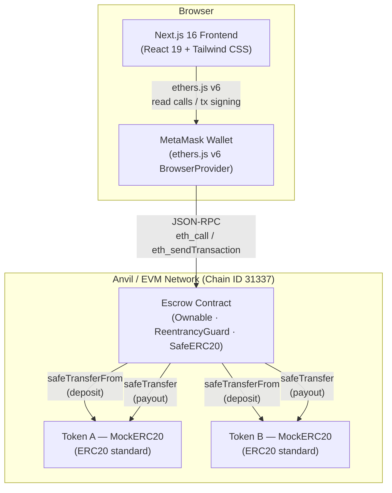
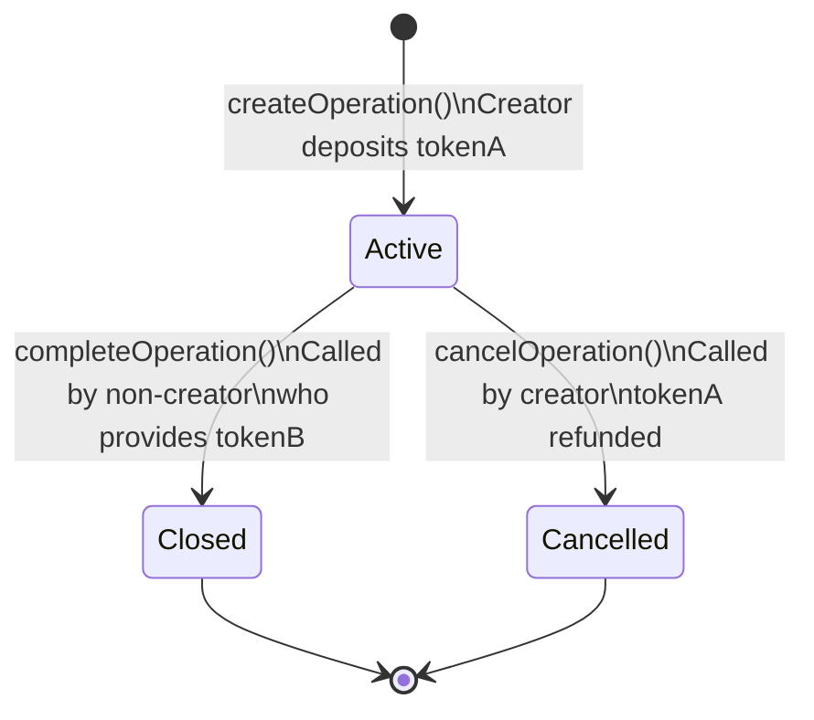
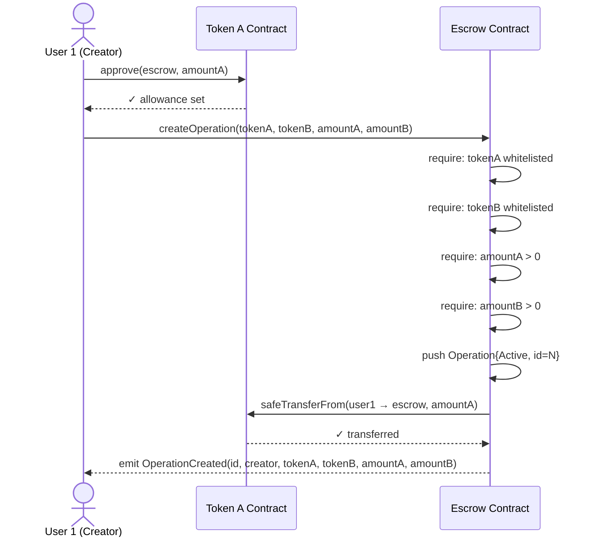
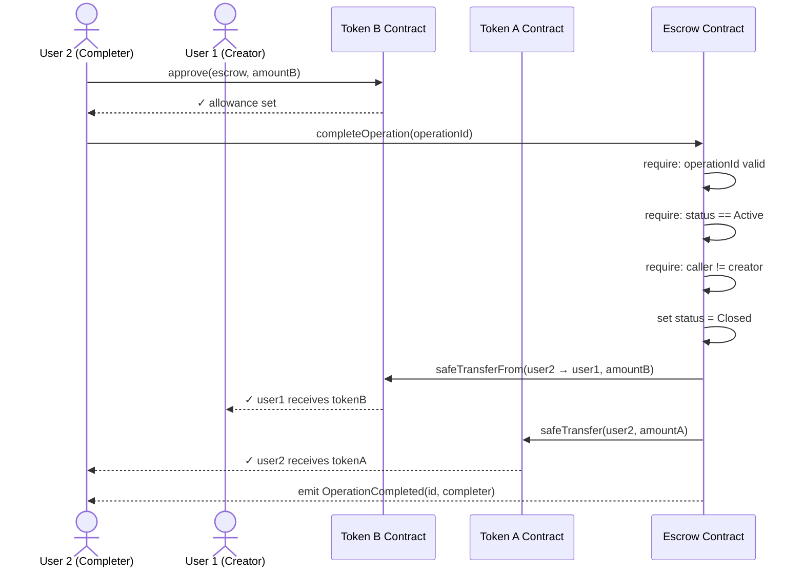
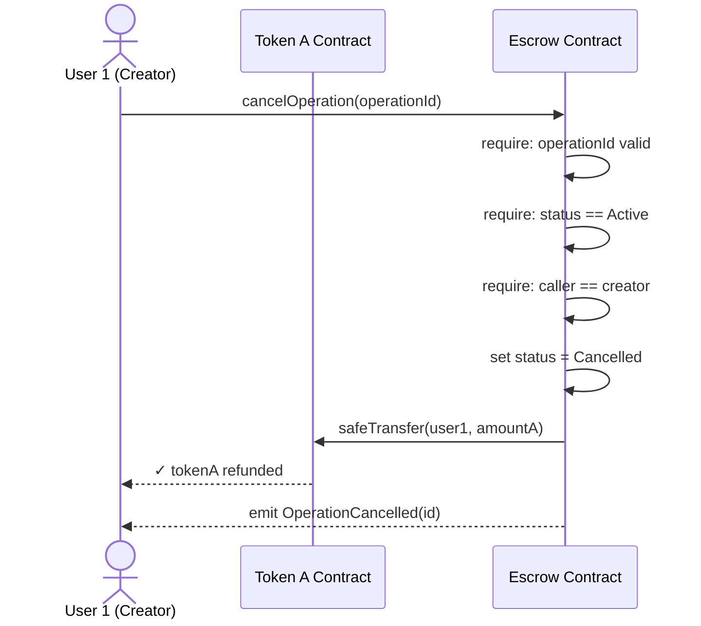
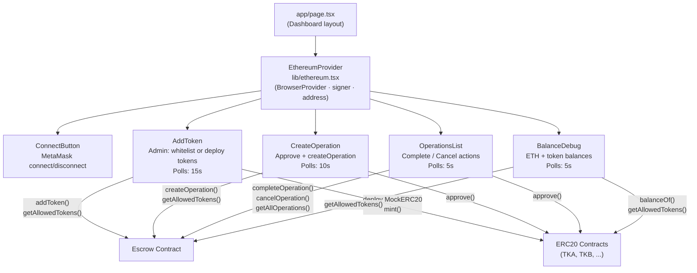
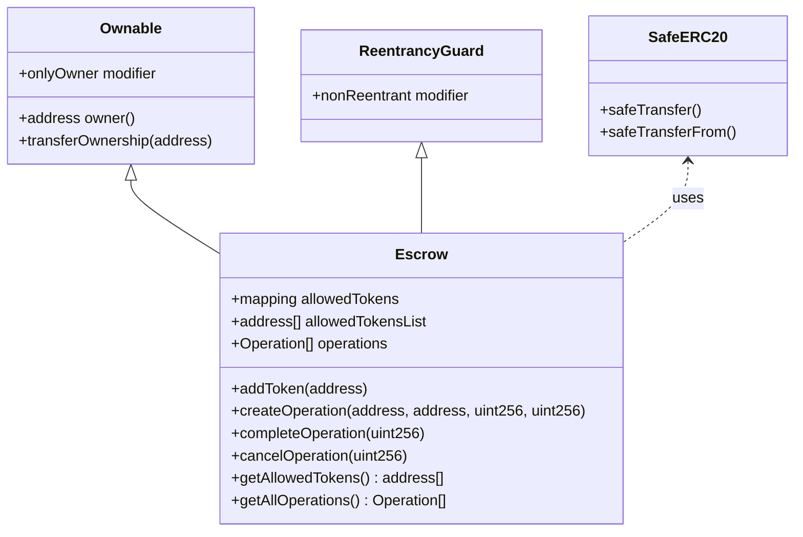

# Architecture

This document describes the system architecture of the Escrow DApp using diagrams.

---

## 1. System Overview

The DApp has two layers: a Next.js browser frontend that communicates with the user's MetaMask wallet, which in turn submits transactions to smart contracts deployed on an Anvil local Ethereum node.

---

## 2. Operation State Machine

An operation begins as `Active` when created. It can only transition once — either to `Closed` (successfully completed) or `Cancelled` (withdrawn by creator). Both terminal states are final.

---

## 3. createOperation — Transaction Sequence

---

## 4. completeOperation — Transaction Sequence

---

## 5. cancelOperation — Transaction Sequence

---

## 6. Frontend Component Architecture

The `EthereumProvider` context wraps the entire application, supplying the connected wallet address, provider, and signer to all child components via the `useEthereum()` hook. Each component polls the contracts independently.

---

## 7. Smart Contract Inheritance

